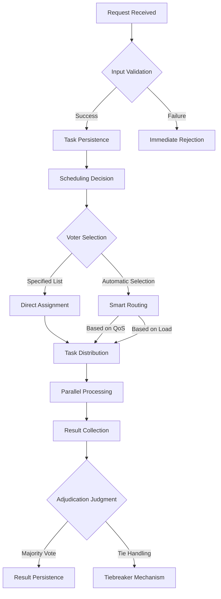

# Business Architecture

## Business Roles

### Initiator (External Agent)

* Typically an external platform or Agent (e.g., CodeGen) that generates some output for a user.
* Submits a request to the MAGI System to get the output reviewed or judged.
* Must provide the original user request, the generated answer, and an optional list of voters to be involved in the evaluation.

### Voter

* Registered within the MAGI System, possibly from the system owner/operator or third-party collaborators.
* Each voter acts as an Agent with its own logic or model for analyzing the submitted content, deciding whether to pass or reject it.
* Returns a vote (e.g., pass, fail, etc.) to the MAGI System.

### The MAGI System

* The central manager of the entire voting process.
* Receives and parses requests from Initiators, dispatches them to the relevant voters, collects all votes, and aggregates them to produce a final result.
* By default, the system’s aggregation logic follows a “minority rule” strategy (or it can be configured for other methods) to decide whether the submission passes or fails.
* Sends back status updates and final results to the Initiator via WebSocket.

### Business Process Flow (High-Level)

1. **Request Submission**

* The Initiator sends a request through a WebSocket connection to the MAGI System, providing:
  * A request\_id (provided by the Initiator or assigned by MAGI System).
  * The original user question or demand.
  * The generated answer or content.
  * (Optional) A list of intended voters.

2. **Request Reception & Queuing**

* The MAGI System acknowledges the receipt of the request (via WebSocket).
* The request is queued or otherwise scheduled for processing, and request\_id is confirmed.

3. **Voter Dispatch**

* If a voter list is provided, the request is forwarded to those specified voters.
* If no voter list is included, the MAGI System chooses suitable voters based on internal configuration or strategy.

4. **Voter Processing**

* Each voter receives the request payload, analyzes it, and returns a vote (e.g., pass, fail, or additional categories).
* Voters may also emit intermediate events if they have a long decision-making process.

5. **Result Aggregation**

* The MAGI System collects all votes.
* Votes are aggregated according to a default or configured strategy (e.g., minority rule).

6. **Final Result Notification**

The MAGI System sends the final decision (including individual votes and the aggregated outcome) back to the Initiator.

7. **Optional Tracking & Retrying**

* The Initiator may subscribe to various events to track the process in real time.
* If the result is unsatisfactory or requires re-evaluation, the Initiator can re-submit a request.

#### Diagram

### Main Business Functions

#### Vote Initiation

* Interface: **WebSocket**
* Input: User query, generated content, (optional) list of Voters
* Output: An acknowledgment event and subsequent status updates

#### Voting & Judgment

* Either the Initiator specifies particular voters, or the MAGI System selects them automatically.
* Each voter evaluates the content and returns pass/fail or another appropriate result.

#### Vote Aggregation

* Collect individual votes from all assigned voters.
* Apply a defined rule or strategy (default: minority rule).
* Output the final judgment and voting details.

#### Event Dispatch (Asynchronous)

* Send progress events at each phase to the Initiator (JSON or another defined format).
* Enables real-time monitoring of the voting process and retrieval of the final decision.

