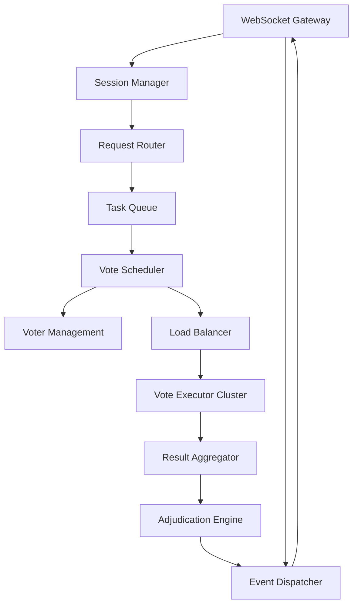
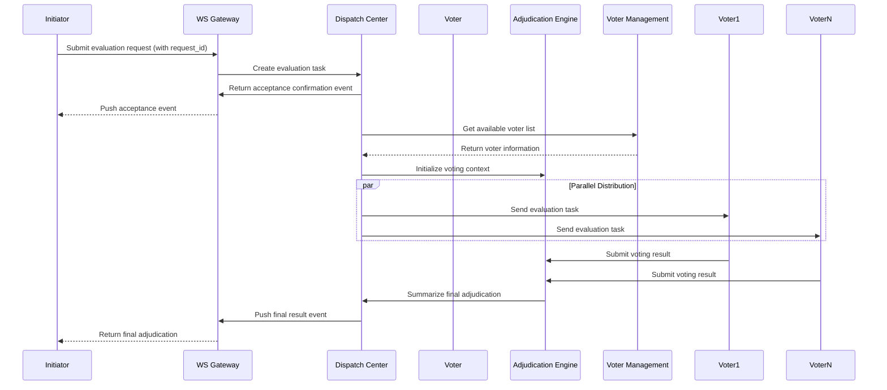

# System Architecture

## High-Level System Architecture

The **MAGI System** offers an asynchronous voting architecture, accessible through a WebSocket interface, enabling external Initiators to submit generated content for review by multiple Voters. Its business architecture is centered around the roles of Initiator and Voter, with a workflow that supports parallel and asynchronous judgments. The system architecture comprises five principal components—WebSocket Gateway, Orchestrator, Voter Agents, an optional Message Bus, and a Data Store—providing a modular, scalable solution for content discrimination and voting. This design not only fits various use cases and performance requirements but also simplifies ongoing operations, security, and monitoring.

From a system standpoint, MAGI System can be divided into the following core components:

1. **WebSocket** **Gateway**

* Exposes the WebSocket interface to external Initiators.
* Receives requests and returns intermediate events and final results.
* Communicates internally with the Orchestrator.

2. **Orchestrator (Voting Dispatcher)**

* Manages request processing, coordinates the voters, collects their votes, and aggregates the results.
* Tracks the status and registration of all Voters.
* Decides how and where to send requests when a Voter list isn’t specified.

3. **Voter Agents / Voter Proxy Layer**

* Each voter can be an internal or external Agent with a standardized protocol to communicate with the MAGI System.
* The Orchestrator sends requests to these voter services, awaits their responses, and passes them back to the Gateway.

4. **Message/Events Bus (Optional)**

* Facilitates asynchronous communication among components.
* Helps handle large numbers of concurrent requests and potentially slow voter decisions.

5. **Data Storage (Database / Cache)**

* Stores request records, voting results, intermediate states, and voter registration details.
* Can be split into temporary storage (to cache the current state of processing) and a persistent database (for long-term audit and analytics).

### Architecture Diagram (Conceptual)




## Component Responsibilities & Interactions




## System Architecture Overview

1. **WebSocket Gateway**

* The single entry point for external requests:
  * Exposes a WebSocket endpoint for Initiators.
  * Receives request payloads (containing request\_id, user question, generated answer, voter list if any) and forwards them to the Orchestrator.
  * Sends asynchronous status events and final results back to the Initiator:
    * All events include the request\_id for correlation.
    * Event types might include: request received, processing started, voter in progress, voter result, final system result.

2. **Orchestrator**

* Parses incoming requests and determines the appropriate set of voters if none is explicitly provided.
* Orchestrates voting by:
  * Creating a voting task for each voter.
  * Communicating with each voter via a message bus or direct API calls.
  * Gathering votes, storing them, and performing final aggregation.
  * Computes the final outcome based on the votes (default “minority rule” or other strategies).
  * Sends aggregated results to the WebSocket Gateway for onward transmission to the Initiator.

3. **Voter Agents / Voter Proxy Layer**

* Receive requests that include context such as the user question, the generated answer, and relevant metadata.
* Implement their own logic or model to decide whether the submission is acceptable (pass/fail) or other decisions.
* Return results to the Orchestrator and can also send intermediate progress events if needed.

4. **Message/Events Bus**

* Handles asynchronous messaging among the Gateway, Orchestrator, and Voters.
* Ensures reliable operation and scalability, especially in scenarios with high concurrency or time-consuming voting tasks.
* Could leverage technologies like Kafka, RabbitMQ, or Redis Pub/Sub.

5. **Data Storage**

* Records voting processes and outcomes:
  * request\_id, Initiator ID, timestamp of request.
  * Voter list and results, timestamps, optional justification or reasoning.
  * Final outcome and completion timestamp.
* Enables auditing, reporting, and analytics, such as analyzing voter reliability or system accuracy over time.

## Example Requests & Events

Suppose an Initiator (external Agent) sends the following JSON payload via WebSocket:

```json
{
  "type": "request",
  "request_id": "abc123",
  "user_query": "Please generate some code for me",
  "agent_answer": "function helloWorld() { console.log('Hello, World!'); }",
  "voter_list": ["voter_1", "voter_2"] // optional
}
```

The system might respond with a series of event messages:

1. **Request Acknowledgment**

```json
{
  "type": "acknowledged",
  "request_id": "abc123",
  "status": "received"
}
```

2. Voter Processing Events

Voter 1 started processing:

```json
{
  "type": "voter_progress",
  "request_id": "abc123",
  "voter_id": "voter_1",
  "status": "processing"
}
```

Voter 1’s result:

```json
{
  "type": "voter_result",
  "request_id": "abc123",
  "voter_id": "voter_1",
  "vote": "pass"
}
```

Voter 2’s result:

```json
{
  "type": "voter_result",
  "request_id": "abc123",
  "voter_id": "voter_2",
  "vote": "fail"
}
```

3. **Final Aggregated Result**

```json
{
  "type": "final_result",
  "request_id": "abc123",
  "final_vote": "fail", // If only two voters: "minority rule" leads to "fail"
  "details": {
    "voter_1": "pass",
    "voter_2": "fail"
  }
}
```

## Asynchronous Processing & Scalability

* **Asynchronous Messaging** allows the voting process to span multiple nodes or networks, greatly enhancing fault tolerance and scalability.
* Onboarding a new voter is straightforward: register it with the Orchestrator and ensure it implements the standard voting protocol.
* When more (or fewer) voters are needed, a simple configuration update suffices without broad changes to the overall system design.

## Security & Access Control

* **Authentication**: The WebSocket Gateway should validate Initiators (e.g., via tokens) to ensure only authorized external Agents can send requests.
* **Voter Management**: The system should maintain an access control model to ensure only authorized voters can participate.
* **Data Privacy**: Because user requests and generated content may contain sensitive information, communication should use secure channels (HTTPS/WSS), and data at rest may require encryption or strict access controls.

## Operations & Monitoring

* Monitoring Metrics:
  * Requests per second, number of active requests.
  * Voter response latency, success rate, error rate.
  * Distribution of pass/fail outcomes to detect potential anomalies.
* Logging & Auditing:
  * Comprehensive logs of request flows, voting events, and system errors.
  * Audit logs for investigating issues and optimizing performance.
* Alerts:
  * Trigger alerts if a voter is unresponsive or fails too frequently.
  * The Orchestrator could automatically remove unresponsive voters from active duties to maintain overall service quality.
